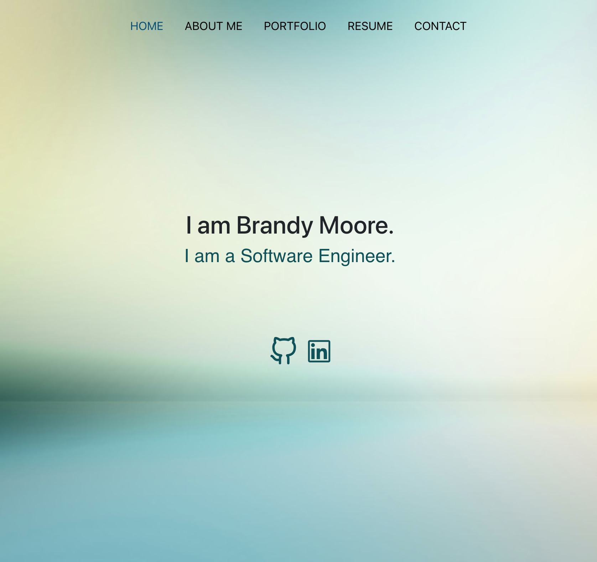

# react-portfolio
20-React

## Table of Contents
1. [Description](#description)
2. [Submission](#submission)
3. [Visuals](#visuals)

## Description
This application is a react portfolio that allows me to share my work with future employers and developers.

[GitHub Repo](https://github.com/BrandyM98/react-portfolio)

## Submission

[Deployed Application](https://brandym98.github.io/react-portfolio/)

## Visuals
Here is a visual of the front-end of the webpage design!

